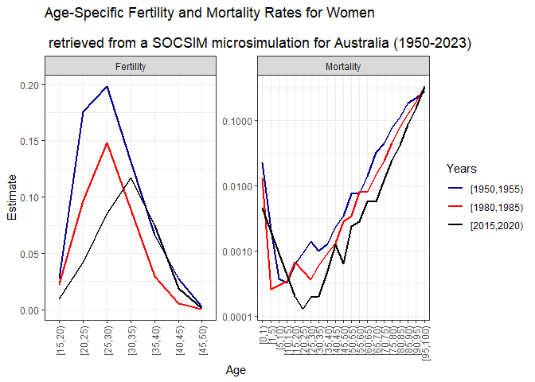
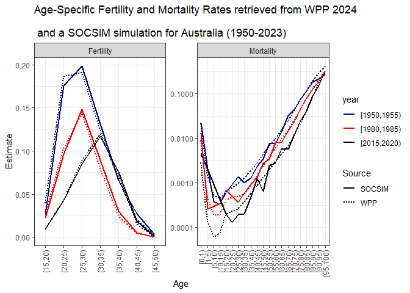
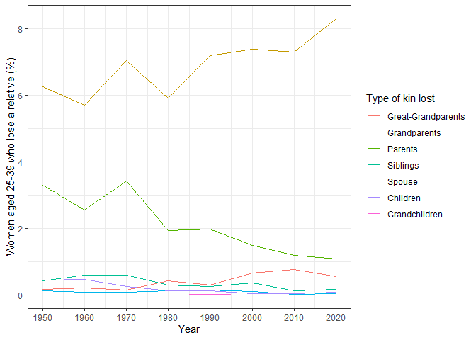
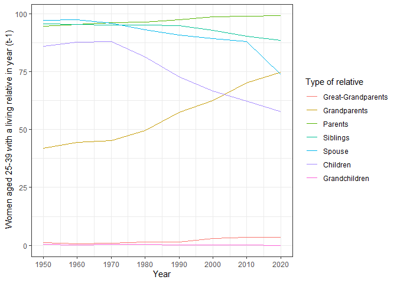

Demographic microsimulations in R using SOCSIM: Modelling population and
kinship dynamics
================
Pre-conference workshop for the 30th International Population
Conference; Brisbane, Australia, 13 July 2025

- [1. Setup](#1-setup)
- [2. How to set-up, run and verify a microsimulation in
  R?](#2-how-to-set-up-run-and-verify-a-microsimulation-in-r)
- [3. What can you do with simulation output? Example: estimates of kin
  loss and
  availability](#3-what-can-you-do-with-simulation-output-example-estimates-of-kin-loss-and-availability)
- [4. Learn more](#4-learn-more)
- [References](#references)

## Introduction: What is SOCSIM and how it works?

Socsim was originally developed for Unix at UC Berkeley (E. Hammel et
al. 1976), where it has been maintained for decades. The current release
of rsocsim aims to be Operating System-agnostic and, for the most part,
back-compatible with the original Socsim distribution. For more on the
original SOCSIM, see <https://lab.demog.berkeley.edu/socsim/> and
especially Mason (2016).

The following description of SOCSIM was adapted from the Supplementary
Materials of Alburez‐Gutierrez, Mason, and Zagheni (2021). SOCSIM is an
open source and extensible demographic microsimulation program. It is
written in the C programming language and relies heavily on arrays of
linked lists to keep track of kinship relationships and to store
information about simulated individuals. The simulator takes as input
initial population files and monthly age-specific fertility and
mortality demographic rates. The individual is the unit of analysis of
the simulator. Each person is subject to a set of rates, expressed as
monthly probabilities of events, given certain demographic
characteristics, like age and sex. Every month, each individual faces
the risk of experiencing a number of events, including childbirth,
death, and marriage. The selection of the event and the waiting time
until the event occurs are determined stochastically using a competing
risk model. Some other constraints are included in the simulation
program in order to draw events only for individuals that are eligible
for the events (e.g. to allow for a minimum interval of time between
births from the same mother, to avoid social taboos such as incest,
etc.). Each event for which the individual is at risk is modeled as a
piece-wise exponential distribution. The waiting time until each event
occurs is randomly generated according to the associated demographic
rates. The individual’s next event is the one with the shortest waiting
time.

At the end of the simulation, population files that contain a list of
everyone who has ever lived in the population are created. In these
files, each individual is an observation in a rectangular data file with
records of demographic characteristics for the individual, and
identification numbers for key kinship relations. SOCSIM models “closed”
populations: Individuals may enter and exit the simulation only by
(simulated) birth and death.

SOCSIM has been used extensively in social science research to study,
among other things, dynamics of kin availability (E. A. Hammel 2005;
Kenneth W. Wachter 1997; Verdery and Margolis 2017), generational
overlap (Margolis and Verdery 2019; Alburez‐Gutierrez, Mason, and
Zagheni 2021), and kin loss (Zagheni 2011; Verdery et al. 2020; Snyder
et al. 2022).

# 1. Setup

We recommend that you go through point 1 of this tutorial **before** the
start of the workshop. If you have any questions/difficulties with the
installation of `rsocsim`, please get in touch with the software
developet [Tom Theile](mailto:theile@demogr.mpg.de)


## 1.1. Installation

Install the development version of `rsocsim` from GitHub
(<https://github.com/MPIDR/rsocsim>). We may have made changes to the
`rsocsim` package ahead of this workshop. To be on the safe side, if you
have already installed the package, please uninstall and reinstall it.
You can install `rsocsim` from source, which requires a compiler, or
from a binary package. Choose the option that suits you best. For this
workshop, we will use version 1.5.9 of `rsocsim`

### 1.1.1 Installation from source (requires a compiler)

To get the latest version, you need to have a Rcpp compatible compiler
installed and some way to install packages from Github. Install a Rcpp
compatible compiler: - on Windows: RTools - on Mac: xcode-select
–install - on Linux: sudo apt-get install r-base-dev

To install packages from Github, you can use the
[`remotes`](https://cran.r-project.org/web/packages/remotes/index.html)
or
[`devtools`](https://cran.r-project.org/web/packages/devtools/index.html)
packages.

``` r
# remove.packages("rsocsim")
# Using remotes
remotes::install_github("MPIDR/rsocsim", ref='v1.5.9')

# Using devtools
# install.packages("devtools")
#devtools::install_github("MPIDR/rsocsim@v1.5.9")
```

### 1.1.2 Installation binary package

Download the correct binary package from the [release section on
Github](https://github.com/MPIDR/rsocsim/releases), version 1.5.9 We
will use rsocsim_1.5.9.tgz Click here for
(<https://github.com/MPIDR/rsocsim/releases/download/v1.5.9/rsocsim_1.5.9.tgz>).
Then execute the following line in R and choose the downloaded file:

``` r
install.packages(file.choose(),repos=NULL,type="binary")
```

Let’s see if everything is working fine. `rsocsim` has a simple built-in
simulation that you can run to see if the package was installed
correctly. For now, let’s run the code without focusing on the technical
details:

``` r
library(rsocsim)

# Create a new folder for all the files related to a simulation.
# This will be in your home- or user-directory:
folder = rsocsim::create_simulation_folder()

# Create a new supervisory-file. 
# supervisory-files tell socsim what to simulate. 
# create_sup_file() will create a very basic supervisory file
# and copy some rate-files that will also be needed into the simulation folder:
supfile = rsocsim::create_sup_file(folder)

# Choose a random-number seed:
seed = 300

# Start the simulation:
rsocsim::socsim(folder,supfile,seed)
```

    ## [1] "Start run1simulationwithfile"
    ## [1] "C:/Users/calderonbernal/socsim/socsim_sim_62"
    ## [1] "300"
    ## Start socsim
    ## start socsim main. MAXUYEARS: 200; MAXUMONTHS: 2400
    ## ratefile: socsim.sup
    ## 
    ## v18a!-command-line argv[0]: zerothArgument| argv[1]: socsim.sup| argv[2]: 300| argv[3]: 1
    ## random_number seed: 300| command-line argv[1]: socsim.sup| argv[2]: 300
    ## compatibility_mode: 1| command-line argv[3]: 1
    ## Socsim Version: STANDARD-UNENHANCED-VERSION
    ## initialize_segment_vars
    ## initialize_segment_vars done
    ## 18b - loading -.sup-file: socsim.sup
    ## 18b-load.cpp->load . socsim.sup
    ## #load.cpp->load 4. socsim.sup
    ## 18b-load.cpp->load . SWEfert2022
    ## #load.cpp->load 4. SWEfert2022
    ## Incomplete rate set, will add rate till MAXUYEARS (death-->1.0; others:0.0) 12
    ## Incomplete rate set, will add rate till MAXUYEARS (death-->1.0; others:0.0) 12
    ## 18b-load.cpp->load . SWEmort2022
    ## #load.cpp->load 4. SWEmort2022
    ## Incomplete rate set, will add rate till MAXUYEARS (death-->1.0; others:0.0) 12
    ## Incomplete rate set, will add rate till MAXUYEARS (death-->1.0; others:0.0) 12
    ## Incomplete rate set, will add rate till MAXUYEARS (death-->1.0; others:0.0) 12
    ## Incomplete rate set, will add rate till MAXUYEARS (death-->1.0; others:0.0) 12
    ## Incomplete rate set, will add rate till MAXUYEARS (death-->1.0; others:0.0) 12
    ## Incomplete rate set, will add rate till MAXUYEARS (death-->1.0; others:0.0) 12
    ## Incomplete rate set, will add rate till MAXUYEARS (death-->1.0; others:0.0) 12
    ## Incomplete rate set, will add rate till MAXUYEARS (death-->1.0; others:0.0) 12
    ## ------------4marriage_eval == DISTRIBUTION . socsim.sup
    ## ------------6------------7
    ##  output file names:
    ##  init_new.opop|init_new.omar|init_new.opox|sim_results_socsim.sup_300_/result.pyr|sim_results_socsim.sup_300_/result.stat|init_new.otx|
    ## fix pop pointers..
    ## Starting month is 601
    ## Initial size of pop 8000  (living: 8000)
    ## ------------aa3s------------aa32New events generated for all living persons
    ## ------------b1month:  700 PopLive:  9414 Brths:  16 Dths:   0 Mrgs: 11 Dvs:  0 Mq: 3728 Fq:0 ti1: 0.3 ti2: 0.007000 0.5037
    ## month:  800 PopLive: 10926 Brths:  12 Dths:   1 Mrgs:  6 Dvs:  0 Mq: 3890 Fq:0 ti1: 0.4 ti2: 0.007000 0.4626
    ## month:  900 PopLive: 12260 Brths:  14 Dths:   0 Mrgs:  4 Dvs:  0 Mq: 4031 Fq:0 ti1: 0.5 ti2: 0.005000 0.3077
    ## month: 1000 PopLive: 13397 Brths:   9 Dths:   2 Mrgs:  4 Dvs:  0 Mq: 4134 Fq:0 ti1: 0.7 ti2: 0.006000 0.3511
    ## month: 1100 PopLive: 14172 Brths:  16 Dths:   6 Mrgs:  6 Dvs:  0 Mq: 4135 Fq:0 ti1: 0.8 ti2: 0.008000 0.4679
    ## month: 1200 PopLive: 14518 Brths:  13 Dths:  11 Mrgs:  6 Dvs:  0 Mq: 4000 Fq:0 ti1: 1.0 ti2: 0.007000 0.4375
    ## month: 1300 PopLive: 14323 Brths:  14 Dths:  20 Mrgs:  4 Dvs:  0 Mq: 3891 Fq:0 ti1: 1.1 ti2: 0.007000 0.4624
    ## month: 1400 PopLive: 13816 Brths:  13 Dths:  15 Mrgs:  4 Dvs:  0 Mq: 3746 Fq:0 ti1: 1.3 ti2: 0.007000 0.4988
    ## month: 1500 PopLive: 13330 Brths:  11 Dths:  11 Mrgs:  5 Dvs:  0 Mq: 3679 Fq:0 ti1: 1.4 ti2: 0.008000 0.5911
    ## month: 1600 PopLive: 12944 Brths:  10 Dths:  15 Mrgs:  4 Dvs:  0 Mq: 3593 Fq:0 ti1: 1.6 ti2: 0.007000 0.5422
    ## month: 1700 PopLive: 12525 Brths:  10 Dths:  20 Mrgs:  5 Dvs:  0 Mq: 3436 Fq:0 ti1: 1.7 ti2: 0.006000 0.5082
    ## month: 1800 PopLive: 12009 Brths:  10 Dths:  16 Mrgs:  7 Dvs:  0 Mq: 3275 Fq:0 ti1: 1.8 ti2: 0.008000 0.7459
    ## 
    ## 
    ## Socsim Main Done
    ## Socsim Done.
    ## [1] "restore previous working dir: U:/SOCSIM/rsocsim_workshop_ipc"

    ## [1] 1

You should see a long output in the console, at the end of which is the
message “Socsim done”. Ignore the two warning messages (‘can’t open
transition history file. Hope that’s OK’). They are expected.

For more details on the package, the SOCSIM simulator, its history and
applications, see `rsocsim`’s website:
<https://mpidr.github.io/rsocsim/>.

## 1.2. Install other packages

We will need these other for this workshop (if you don’t have them
already, please install them):

``` r
# devtools::install_github("MPIDR/rsocsim")
library(rsocsim)
# install.packages("tidyverse")
library(tidyverse) # For data wrangling
# install.packages("ggh4x")
library(ggh4x) # For extended facet plotting
# install.packages("data.table") # For large datasets
library(data.table)
```

# 2. How to set-up, run and verify a microsimulation in R?

### Objectives

1.  Use data from the World Population Prospects (WPP) 2024 to create a
    simulation from scratch
2.  Run a simple SOCSIM simulation for Australia
3.  Estimate age-specific fertility and mortality rates using the
    SOCSIM-generated microdata
4.  Check that the ‘output’ SOCSIM rates match the ‘input’ WPP rates

## 2.1. The simulation: supervisory and rate files

To provide an example of `rsocsim` usage, we will run a SOCSIM
microsimulation for Australia over the period 1950-2023. This
microsimulation uses as input: age-specific fertility rates by calendar
year and single age and age-specific probabilities of death by calendar
year and sex downloaded from the [World Population Prospects (WPP)
2024](https://population.un.org/wpp/). To run the simulation, the
original WPP data must be first converted to monthly rates/probabilities
and SOCSIM format as described in Socsim Oversimplified (c.f. Mason 2016
for details). The rates corresponding to each year are specified in the
supervisory file `socsim_Australia.sup`, provided in this repository,
which will be used to run the simulation. The first segment of the
simulation runs for 100 years (1200 months) to produce a stable age
structure, based on WPP rates/probabilities for 1950. Each of the
following segments runs for one year (12 months) with the corresponding
fertility and mortality files.

## 2.2. Write the input rate files for a SOCSIM simulation for Australia, 1950-2023

The structure of the rate files is essential to run SOCSIM. According to
Socsim Oversimplified (c.f. Mason 2016, 26–28), a rate block is a
complete set of age specific rates governing a demographic event for
people of a particular sex, group and marital status. In the rate files,
the order is always: event (birth, death, marriage), group (1, ..), sex
(F or M), and marital status (married, single, divorced, widowed). For
the birth rates, this can be followed by number indicating parity. Each
subsequent line contains a one month rate or probability and the age
interval over which it holds (years and months of the upper age bound).
The interval includes the upper age bound in previous line and ends just
before the upper age bound in current line. The first two numbers are
years and months of the upper age bound, which are added together,
e.g. upper age bound of “1 0” or “0 12” refers to the first year of life
\[0,1).

Let’s load some functions we prepared to write SOCSIM rate files from
WPP 2024 data.

``` r
# Load functions to write SOCSIM rate files
source("functions_rates.R")
```

### 2.2.1. Fertility files for SOCSIM

As input fertility data, we use the whole range of the fertility rates
by single age of the mother provided by the WPP 2024 \[15-49\]. Younger
\[10-14\] and older \[50-54\] age groups are only provided in the
estimates by 5-year age groups. Additionally, SOCSIM requires a final
age category with an upper bound corresponding to the maximum length of
life. Here, we fixed it to \[50-100\], to be consistent with the
structure of the life tables.

To convert the annual rates to monthly rates we assume that the
fertility rates are constant over the year and divide them by 12
(months). According to SOCSIM oversimplified, these are rates rather
than probabilities. So multiplying a rate by the number of months in the
age category gives the expected number of births that a woman who lives
through the age category will experience.

The are identical for all marital status, but are specified for single
and married women in the rate files. Other marital status (divorced,
widowed, cohabiting) follow SOCSIM’s rate default rules.

For this exercise, we will use age-specific fertility rates all birth
orders combined by calendar year and single age of the mother for a
selected country from the WPP 2024. The data downloaded from the [WPP
website](https://population.un.org/wpp/Download/Files/1_Indicator%20(Standard)/CSV_FILES/WPP2024_Fertility_by_Age1.csv.gz/),
filtered for one country and keeping only relevant variables is provided
in `data/fertility_Australia.RData`. If you want to run the analysis for
another territory, you can use the function `UNWPP_data()` in
`UNWPP_data.RData` and select a different location, ISO2_code or
ISO3_code to filter the WPP 2024 data.

The function below converts the WPP 2024 fertility data (filtered for a
country using the function `UNWPP_data()`) to SOCSIM format following
the procedure explained above. To run it, type the name of the country
(region, subregion, or area) as listed in the WPP 2024 (e.g.,
“Australia”). Please, verify that the data set with the fertility rates
(filtered for the selected country) is saved in the folder `data`.

``` r
write_socsim_fertility_rates_WPP(country = "Australia") 
```

### 2.2.2. Mortality files for SOCSIM

As input mortality data, SOCSIM requires probabilities of death (qx)
from period life tables. We use the whole age range of the single age
life tables provided by the WPP 2024 \[0-100\]. The final age interval
100 is limited to one year, i.e. \[100-101). Originally, SOCSIM had an
upper bound of 100 years, but in `rsocsim` the maximum age has been
extended to 200 years, in case mortality data exceeds the 100 limit.

To convert the annual WPP probabilities to monthly ‘SOCSIM’
probabilities, we assume that the probability of dying is constant over
the year and use the formula
^{1/n}")
proposed by Kenneth Watcher (Kenneth W. Wachter 2014, 53). For the final
age interval 100, monthly probabilities are equal to 1/12. The
probabilities of death are identical for all marital status of each sex,
and are only specified for single women and single men in the rate
files. Other marital status will follow SOCSIM’s rate default rules.

The WPP2024 methods used to estimate mortality and life tables vary
across countries depending on the type and quality of available
empirical data. For further details, see the Methodology of the United
Nations population estimates and projections (United Nations and Social
Affairs 2024).

For this exercise, we will use period age-specific probabilities of
death by calendar year and single age for a selected country from the
WPP 2024. We provide the data downloaded from the WPP website for
[women](https://population.un.org/wpp/Download/Files/1_Indicator%20(Standard)/CSV_FILES/WPP2024_Life_Table_Complete_Medium_Female_1950-2023.csv.gz/)
and
[men](https://population.un.org/wpp/Download/Files/1_Indicator%20(Standard)/CSV_FILES/WPP2024_Life_Table_Complete_Medium_Male_1950-2023.csv.gz/),
filtered for one country and keeping only relevant variables (saved in
`data/mortality_Australia.RData`). If you want to run the analysis for
another territory, you can use the function `UNWPP_data()` in
`UNWPP_data.RData` and select a different location, ISO2_code or
ISO3_code to filter the WPP 2024 data.

The function below converts WPP 2024 mortality data (filtered for a
country using the function `UNWPP_data()`) to SOCSIM format following
the procedure explained above. To run it, type the name of the country
(region, subregion, or area) as listed in the WPP 2024 (e.g.,
“Australia”). Please, verify that the data set with the probabilities of
death is saved in the folder `data`.

``` r
write_socsim_mortality_rates_WPP(country = "Australia")
```

## 2.3. Create initial population and marriage files

Now that we have the rate files, let’s create the initial population
(.opop) and marriage (.opop) files. For practical reasons, we will use a
small initial population to reduce the time required to run the
simulation and to compute the subsequent code. The initial .opop will
have a size of 1000, with randomly assigned sex and dates of birth, and
group 1 for all. Other columns will be completed during the simulation.
The initial .omar will be an empty file.

``` r
# Set size of initial population
size_opop <-  10000

# Create data.frame with 14 columns and nrows = size_opop
presim.opop <- setNames(data.frame(matrix(data = 0, ncol = 14, nrow = size_opop)), 
                        c("pid","fem","group","nev","dob","mom","pop",
                          "nesibm","nesibp","lborn","marid","mstat","dod","fmult"))

# Add pid 1:sizeopop
presim.opop$pid <- 1:size_opop

# Add sex randomly
presim.opop$fem <- sample(0:1, nrow(presim.opop), replace = T)

# Add group 1 for all individuals
presim.opop$group <- 1

# Add random dates of birth (max age around 50)
presim.opop$dob <- sample(500:1000, nrow(presim.opop), replace = T)

# Write initial population for pre-simulation (without fertility multiplier)
write.table(presim.opop, "presim.opop", row.names = F, col.names = F)


## Create an empty data frame for presim.omar
presim.omar <- data.frame()

# Write empty omar for pre-simulation
write.table(presim.omar, "presim.omar", row.names = F, col.names = F)
```

## 2.4. Run a SOCSIM simulation using the `rsocsim` package

Now that we have created the input rate files and the initial population
and marriage files, we can run the simulation. To use the `socsim`
function, we need to specify the folder where the supervisory and the
rate files are, the name of the supervisory file for the rates retrieved
from the WPP 2024 (1950-2023), and a seed number for the simulation.

``` r
# Specify the folder where the supervisory and the rate files are. 
# If the R session is running through the project, you can use the following command. 
folder <- getwd()

# Type the name of the supervisory file  stored in the above folder:
supfile <- "socsim_Australia.sup"

# Choose a seed number (today's date) for the simulation:
seed <- "130725"

# Run a single SOCSIM-simulation with a given folder and the provided supervisory file
# using the "future" process method
rsocsim::socsim(folder, supfile, seed, process_method = "future")
```

The simulation results are ready. We can use the `read_opop` and
`read_omar` functions from the `rsocsim` package to import the output
population and marriage files into `R`.

``` r
## Read the opop file using the read_opop function

opop <- rsocsim::read_opop(folder = getwd(), supfile = "socsim_Australia.sup",
                           seed = "130725", suffix = "", fn = NULL)
```

    ## [1] "read population file: U:/SOCSIM/rsocsim_workshop_ipc/sim_results_socsim_Australia.sup_130725_/result.opop"

``` r
## Read the omar file using the read_opop function
omar <- rsocsim::read_omar(folder = getwd(), supfile = "socsim_Australia.sup",
                           seed = "130725", suffix = "",  fn = NULL)
```

    ## [1] "read marriage file: U:/SOCSIM/rsocsim_workshop_ipc/sim_results_socsim_Australia.sup_130725_/result.omar"

Let’s have a glimpse on the simulated population and marriage files.

The population file (.opop) contains one record for each individual who
was ever alive during the simulation. Each record (row) provides the
following information for a given individual: person id (pid), sex (fem,
1 for female and 0 for male), group identifier (group), next scheduled
event (nev), date of birth (dob), person id of mother (mom), person id
of father (pop), person id of next eldest sibling through mother
(nesibm), person id of next eldest sibling through father (nesibp),
person id of last born child (lborn), id of most recent marriage in
.omar file (marid), marital status at end of simulation (mstat), date of
death (dod, or 0 if alive at end of simulation) and fertility multiplier
(fmult). For more information on what these columns are, see:
<https://lab.demog.berkeley.edu/socsim/CurrentDocs/socsimOversimplified.pdf>.

``` r
head(opop)
```

    ##   pid fem group nev dob mom pop nesibm nesibp lborn marid mstat  dod    fmult
    ## 1   1   1     1  65 766   0   0      0      0 13533   919     4 1513 2.042263
    ## 2   2   1     1  65 629   0   0      0      0 10111   111     3 1566 0.758478
    ## 3   3   0     1  65 582   0   0      0      0     0     0     1 1326 0.000000
    ## 4   4   1     1  65 946   0   0      0      0 21475  3031     4 1548 2.071625
    ## 5   5   0     1  65 765   0   0      0      0 14995   613     4 1326 0.000000
    ## 6   6   1     1  65 695   0   0      0      0 15679   170     3 1704 0.696812

The marriage file (.omar) contains one record for each marriage. Each
marriage record provides the following information: marriage id number
(mid), wife’s person id (wpid), husband’s person id (hpid), date
marriage began (dstart), date marriage ended (dend, it’s 0 if in force
at the end of simulation), reason marriage ended (rend), marriage id of
wife’s next most recent prior marriage (wprior), marriage id of
husband’s next most recent prior marriage (hprior).

``` r
head(omar)
```

    ##   mid wpid hpid dstart dend rend wprior hprior
    ## 1   1 4364 6350   1001 1354    3      0      0
    ## 2   2 3913 7541   1001 1448    3      0      0
    ## 3   3 3621 9985   1001 1136    3      0      0
    ## 4   4  654 3647   1001 1142    3      0      0
    ## 5   5 9832 2060   1001 1497    3      0      0
    ## 6   6 2625 4467   1001 1410    3      0      0

## 2.5. Estimate age-specific rates from the SOCSIM microsimulation

To check the accuracy of our microsimulation for Australia, we can
estimate and compare input and output age-specific fertility and
mortality rates (ASFR and ASMR) by sex. For this purpose, we can use the
`estimate_fertility_rates()` and `estimate_mortality_rates()` functions
from the package. Please note that these calculate age-specific rates
for both fertility and mortality, as they use mid-year population size
by sex and age as an estimate of person-years lived during the year.
Hence, the population in the denominator includes all those who were
born before the
 of
July of a given year and die in or after July of that year or are still
alive at the end of the simulation. Due to the limited population size
in a microsimulation (especially, of survivors at old ages), sometimes
few or no individuals of a specific age are alive at a exact point in
time (here, 1st July). Hence, it is possible to obtain rates higher than
1, equal to 0 (0 Events/Population), infinite (Events/0 Population) and
NaN (0 Events/0 Population) values with these functions.  
To run them, we need to define some arguments: the .opop file `opop`,
final year of the simulation `final_sim_year`, the minimum and maximum
years for which we want to estimate the rates, \[`year_min` and
`year_max`), the size of the year group `year_group`, the minimum and
maximum age for fertility \[`age_min_fert` and `age_max_fert`) or the
maximum age for mortality `age_max_mort`) and the size of the age group
`age_group`. We can compute the rates by different year and age groups
(e.g., 1, 5, or 10), but please check that the minimum and maximum years
and ages correspond to the groups size. Let’s run the code.

``` r
# Estimate age-specific fertility rates
asfr_sim <- rsocsim::estimate_fertility_rates(opop = opop,
                                              final_sim_year = 2023, #[Jan-Dec]
                                              year_min = 1950, # Closed [
                                              year_max = 2020, # Open )
                                              year_group = 5, 
                                              age_min_fert = 15, # Closed [
                                              age_max_fert = 50, # Open )
                                              age_group = 5) # [,)

# Estimate age-specific mortality rates
asmr_sim <- rsocsim::estimate_mortality_rates(opop = opop, 
                                              final_sim_year = 2023, # [Jan-Dec]
                                              year_min = 1950, # Closed
                                              year_max = 2020, # Open )
                                              year_group = 5,
                                              age_max_mort = 100, # Open )
                                              age_group = 5) #[,)
```

We can now plot our SOCSIM-derived estimates of ASFR and ASMR for women
in some selected years.

``` r
# Choose years to plot (in intervals).
yrs_plot <- c("[1950,1955)", "[1980,1985)", "[2015,2020)") 

# Get the age levels to define them before plotting and avoid wrong order
age_levels <- levels(asmr_sim$age)

bind_rows(asfr_sim %>%
            mutate(rate = "Fertility",                   
                   sex = "female"),
          asmr_sim %>% 
            mutate(rate = "Mortality") %>% 
            filter(sex == "female")) %>% 
  mutate(age = factor(as.character(age), levels = age_levels)) %>% 
  # Filter rates of 0, infinite (N_Deaths/0_Population) and NaN (0_Deaths/0_Population) values
  filter(socsim !=0 & !is.infinite(socsim) & !is.nan(socsim)) %>% 
  filter(year %in% yrs_plot) %>% 
  ggplot(aes(x = age, y = socsim, group = year, colour = year)) +
  geom_line(linewidth = 1) +
  facet_wrap(. ~ rate, scales = "free") + 
  facetted_pos_scales(y = list(ASFR = scale_y_continuous(),
                               ASMR =  scale_y_continuous(trans = "log10"))) +
  theme_bw() +
  scale_x_discrete(guide = guide_axis(angle = 90)) +
  scale_color_manual(values = c("#00008B", "#FF0000", "#000000"))+
  labs(title = "Age-Specific Fertility and Mortality Rates for Women 
       \n retrieved from a SOCSIM microsimulation for Australia (1950-2023)",
       x = "Age", y = "Estimate", color = "Years")
```



## 2.6. Compare age-specific rates SOCSIM vs WPP 2024

As an additional check, we can compare the age-specific fertility and
mortality rates retrieved from the SOCSIM output with the original WPP
data used as input for our microsimulation. Since our estimates of
fertility and mortality rates from SOCSIM output are grouped by 5-year
age groups and 5-year calendar periods in the previous example, we
should first estimate the aggregated measures (5x5) from the original
WPP 2024 data. For plotting the data together, we also need some data
wrangling.

Let’s start with fertility estimates.

``` r
# Extract year and age breaks used in the estimate_fertility_rates() to apply the same values to WPP data

# Year breaks. Extract all the unique numbers from the intervals. 
year_breaks_fert <- unique(as.numeric(str_extract_all(asfr_sim$year, "\\d+", simplify = T)))

# Year range to filter WPP data
year_range_fert <- min(year_breaks_fert):max(year_breaks_fert-1)

# Age breaks of fertility rates. Extract all the unique numbers from the intervals 
age_breaks_fert <- unique(as.numeric(str_extract_all(asfr_sim$age, "\\d+", simplify = T)))

# Load the WPP fertility data used to write the input rates and compute age-specific fertility rates by 5-year age groups
load("data/fertility_Australia.RData")

WPP_fert <- fertility_Australia %>% 
  filter(year %in% year_range_fert) %>% 
  mutate(year = cut(year, breaks = year_breaks_fert, 
                    include.lowest = F, right = F, ordered_results = T),
         age = cut(age, breaks = age_breaks_fert, 
                   include.lowest = F, right = F, ordered_results = T)) %>% 
  filter(!is.na(age)) %>% 
  group_by(year, age) %>%
  summarise(ASFR = mean(fx, na.rm = T)) %>%
  ungroup() %>%
  mutate(Source = "WPP", 
         Rate = "Fertility")

# Wrange SOCSIM fertility data
SocsimF <- asfr_sim %>% 
  rename(ASFR = socsim) %>% 
  mutate(Source = "SOCSIM",
         Rate = "Fertility")
```

Now, we will evaluate the mortality estimates. Here, we compare the
SOCSIM mid-year age-specific mortality rates with the central mortality
rates from the WPP life tables.

``` r
# Extract year and age breaks used in the estimate_mortality_rates() to apply the same values to WPP data

# Year breaks. Extract all the unique numbers from the intervals 
year_breaks_mort <- unique(as.numeric(str_extract_all(asmr_sim$year, "\\d+", simplify = T)))

# Year range to filter WPP data
year_range_mort <- min(year_breaks_mort):max(year_breaks_mort-1)

# Age breaks of mortality rates. Extract all the unique numbers from the intervals 
age_breaks_mort <- unique(as.numeric(str_extract_all(asmr_sim$age, "\\d+", simplify = T)))

# Load mortality data used as input and compute age-specific mortality rates by 5-year age groups
load("data/mortality_Australia.RData")

# To facilitate comparison, we will use the central mortality rates (mx) instead of the probabilities (qX)

# Wrangle WPP life tables
WPP_mort <- mortality_Australia %>% 
  select(year, Sex, age, mx) %>% 
  filter(year %in% year_range_mort) %>% 
  mutate(year = cut(year, breaks = year_breaks_mort, 
                    include.lowest = F, right = F, ordered_results = T),
         age = cut(age, breaks = age_breaks_mort, 
                   include.lowest = F, right = F, ordered_results = T)) %>%
  filter(!is.na(age)) %>% 
  group_by(year, Sex, age) %>% 
  summarise(mx = mean(mx, na.rm = T)) %>%
  ungroup() %>% 
    mutate(Source = "WPP",
           Rate = "Mortality")

# Wrangle SOCSIM mortality data
SocsimM <- asmr_sim %>% 
  rename(mx = socsim) %>% 
  mutate(Sex = ifelse(sex == "male", "Male", "Female"),
         Source = "SOCSIM",
         Rate = "Mortality") %>% 
  select(year, Sex, age,  mx, Source, Rate)
```

Finally, we can plot together the age-specific fertility and mortality
rates (ASFR and ASMR) from SOCSIM vs WPP for women in Australia.

``` r
## Plotting ASFR and ASMR (for females) from WPP vs SOCSIM 
bind_rows(WPP_fert %>% rename(Estimate = ASFR), 
          SocsimF %>% rename(Estimate = ASFR)) %>% 
  mutate(Sex = "Female") %>%   
  bind_rows(WPP_mort %>% rename(Estimate = mx),
            SocsimM %>% rename(Estimate = mx)) %>% 
  # Filter rates of 0, infinite (N_Deaths/0_Population) and NaN (0_Deaths/0_Population) values
  filter(Estimate != 0 & !is.infinite(Estimate) & !is.nan(Estimate)) %>% 
  filter(Sex == "Female") %>% 
  mutate(age = factor(as.character(age), levels = age_levels)) %>%
  filter(year %in% yrs_plot) %>% 
  ggplot(aes(x = age, y = Estimate, group = interaction(year, Source)))+
  facet_wrap(. ~ Rate, scales = "free") + 
  geom_line(aes(colour = year, linetype = Source), linewidth = 1)+
  scale_linetype_manual(values = c("WPP" = "11","SOCSIM" = "solid")) +
  facetted_pos_scales(y = list(ASFR = scale_y_continuous(),
                               ASMR =  scale_y_continuous(trans = "log10")))+
  scale_x_discrete(guide = guide_axis(angle = 90)) +
  scale_color_manual(values = c("#00008B", "#FF0000", "#000000"))+
  labs(title = "Age-Specific Fertility and Mortality Rates retrieved from WPP 2024
        \n and a SOCSIM simulation for Australia (1950-2023)", 
       x = "Age", , linetype = "Source") + 
  theme_bw()
```


Overall, the fertility and mortality rates by five-year age groups
derived from the microsimulation are close to the original WPP2024 rates
used as input data, which allows us to consider the results as
sufficiently valid for analysis. However, it is possible to observe some
differences between the two sources, which can be reduced by increasing
the size of the initial population.

# 3. What can you do with simulation output? Example: estimates of kin loss and availability

> Prepared by Mallika Snyder, <https://twitter.com/mallika_snyder>, for
> the PAA 2023 Member Initiated Meeting

### Objectives

1.  Learn how to analyse SOCSIM output
2.  Understand how SOCSIM records kin ties
3.  Use SOCSIM output from the previous section to estimate levels of
    kin loss (and availability) in Australia

After running our simulation code, SOCSIM provides us with a synthetic
genealogy for the entire population. We know when people are born, when
they die, when they marry, and who their parents and spouse are. What
can we do with this information?

One advantage of using a tool like SOCSIM is that we can identify
extended kin networks, especially for more distant kin that would be
hard to link together using a census or a household survey. For example,
how straightforward would it be to find an individual’s
great-grandmother in a household survey, assuming odds of co-residence
are not high? Of course, some kinds of kin are easier to identify than
others, based on the information we have in SOCSIM. When identifying
kin, we use kinship relationships by direct consanguinity -such as
parents and children- or affinity -such as spouses-. This is the
principle behind the `retrieve_kin()` function included in this package,
which can be used to identify kin from a variety of kin relationships
(parents, children, grandparents, spouses, and much more). You can read
the full documentation for this function by typing `?retrieve_kin` into
your RStudio console. An important note is that the kinship terms used
in this function are currently western-specific: other regions may have
very different kinship systems, which may influence kin availability.

As well as allowing us to identify networks more easily, SOCSIM also
provides us with valuable information about the timing of vital events
such as births, deaths, and marriages, in these networks. This can help
us to relate changes in the vital rates that go into SOCSIM to changes
in the networks available to our simulated peoplem, often at a very fine
temporal level (months or years). In this workshop, we will focus on
just one example -kin loss- but there are many other ways to use SOCSIM
to study this and other questions about kinship dynamics.

In previous research, SOCSIM has been especially helpful for studying
kin loss in connection with mortality change (Zagheni 2011; Verdery et
al. 2020; Snyder et al. 2022). Here we will focus on a simple example,
changes in the rate of experiencing the loss of a relative over time. We
will define our reference group as women aged 25-39 and alive in a given
year. Thus, the sample frame will change in each year. Note that the
denominator is all women, not just those with a relative alive.

In our code, we will approach this by writing a function that we will
loop over each year of interest. The function will take in a year, look
for the individuals of the relevant age who are alive that year,
identify the years of death of their kin, and then calculate the
proportion of our sample who experienced a loss. For further intuition,
we will also calculate the share of women who had a relative alive in
the previous year. The code is a simplified version of functions used in
a previous research paper (Snyder et al. 2022).

### 3.1. Getting our estimates

The first thing we require is a helper function to identify the year of
interest. This function is internally included in the `rsocsim` package,
but we will use it here to convert our monthly dates into yearly ones.

``` r
# The function uses the final simulation year (January-December) and the last simulated month to convert SOCSIM months into calendar time

asYr <- function(month, last_month=last_month, final_sim_year=final_sim_year) {
  return(final_sim_year - trunc((last_month - month)/12))
}
```

We need to define a few relevant parameters specific to this simulation
and create some variables

``` r
# Last simulated month
last_month <- max(opop$dob)
# Final simulated year
final_sim_year <- 2023

# Clean our population file
opop <- opop %>% 
  # Fixe dates of death for individuals still living at the end of the simulation
  mutate(dod = if_else(dod == 0, last_month, dod)) %>%
  # Dates of birth and death in years 
  mutate(dob_year = asYr(dob, last_month=last_month, final_sim_year=final_sim_year),
         dod_year = asYr(dod, last_month=last_month, final_sim_year=final_sim_year))
```

Now that we have generated the variables we want, let’s create a simple
function `getKinLoss()` to estimate annual kin loss for women aged 25-39
in a particular year that we can loop over the study period.

``` r
# Estimate annual kin loss for women aged 25-39 in a particular year
getKinLoss <- function(year_of_interest, opop = opop, omar = omar){
  
pid_data <- opop %>%
  # Remove those not alive in the year of interest
  filter(data.table::between(lower = dob_year, upper = dod_year, 
                             year_of_interest, incbounds = FALSE),
  # Filter to women
         fem == 1) %>%
  # Estimate the age of individuals alive
  mutate(age = year_of_interest - dob_year) %>%
  # Filter to women aged 25-39
  filter(data.table::between(lower = 25, upper = 39, age, 
                             incbounds = TRUE))
# Find vector of person IDs
pid_vec <- pid_data$pid

# Use the retrieve_kin function included in `rsocsim`
# We will not identify extended kin relationships (extra_kintypes)
# Or separate kin by sex, but both can be estimated
kin <- rsocsim::retrieve_kin(opop = opop, omar = omar, pid = pid_vec, 
             extra_kintypes = NULL, kin_by_sex = FALSE)

# From retrieve_kin, we get a list of lists named after the type of kin

# Loop over all types of kin included
temp <- bind_rows(lapply(1:length(kin), function(x) {
# Find IDs of kin
kin2 <- unlist(kin[[x]], use.names = FALSE)
# Attach associated person IDs
names(kin2) <- rep(pid_vec, unlist(lapply(kin[[x]], length)))
# Find the years of birth of kin
attr(kin2, "kin_dob_year") <- opop$dob_year[match(kin2, opop$pid)]
# Find the years of death of kin
attr(kin2, "kin_dod_year") <- opop$dod_year[match(kin2, opop$pid)]
# Find which kin were alive in the previous year
attr(kin2, "kin_alive_before_year_of_interest") <- 
  if_else(data.table::between(lower = attr(kin2, "kin_dob_year"), 
                              upper = attr(kin2, "kin_dod_year"), 
                             (year_of_interest-1), NAbounds = NA, 
                             incbounds = FALSE), 
          TRUE, FALSE)
# Find which kin have died in this year
attr(kin2, "kin_death_year_of_interest") <- 
  if_else(attr(kin2, "kin_dod_year") %in% year_of_interest, TRUE, FALSE)

# Find the number of people who had a living relative in the previous year
pid_withkin <- length(unique(names(kin2[attr(kin2,
                                          "kin_alive_before_year_of_interest") 
                                        == TRUE])))

# Find the number of individuals who have lost a relative
pid_losekin <- length(unique(names(kin2[attr(kin2, "kin_death_year_of_interest") 
                                        == TRUE])))
# Find the total number of individuals
pid_total <- length(pid_vec)

# Generate output as a tibble
output <- tibble(kintype = names(kin[x]),
                 year = year_of_interest,
                 n_total = pid_total,
                 n_losekin = pid_losekin,
                 n_withkin = pid_withkin,
                 pc_losekin_total = 100*(n_losekin/n_total),
                 pc_withkin = 100*(n_withkin/n_total))
return(output)
}))
}
```

Now loop through this function to generate a table with our data for
each year. To limit the time this code will take to run, we will
estimate kin loss at 10-year intervals between 1950 and 2020.

``` r
# Loop through the year range and bind rows
full_data <- bind_rows(lapply(seq.int(from = 1950, to = 2020, by = 10), 
                              function(x) getKinLoss(year_of_interest = x, 
                                                     opop = opop, 
                                                     omar = omar)))
```

### 3.2. Examining our estimates

``` r
# Specify and order names of kin
kinloss_data <- full_data %>%
  mutate(kintype = case_when(kintype == "ggparents" ~ "Great-Grandparents",
                             kintype == "gparents" ~ "Grandparents", 
                             kintype == "gchildren" ~ "Grandchildren",
                             TRUE ~ kintype),
         kintype = str_to_title(kintype),
         kintype = fct_relevel(kintype, c("Great-Grandparents", "Grandparents", "Parents", 
                                          "Siblings", "Spouse", "Children", "Grandchildren"))) 
```

Plot kin loss and availability for female population over time.

``` r
# Plot kin loss
kinloss_data %>% 
  ggplot(aes(x = year, y = pc_losekin_total, color = kintype)) + 
  geom_line() +
  labs(x = "Year", y = "Women aged 25-39 who lose a relative (%)", 
       color = "Type of kin lost") +
  scale_x_continuous(breaks = seq(1950, 2020,by = 10))+
  theme_bw() 
```



This graph shows the evolution of rates of kin loss for women in recent
decades. As it could be expected for this age group, the highest rates
of kin loss correspond to grandparents and parents. The increasing rate
of grandparental loss over time could be related to increasing life
expectancy during this period. As grandparents reach older ages, the
chance that a person aged 25-39 has a living grandparent increases. This
is evident in the next plot, which shows changes in kin availability
(the share of the female population with a living relative in the
previous year) over time.

``` r
# Plot changes in kin availability
kinloss_data %>% 
  ggplot(aes(x = year, y = pc_withkin, color = kintype)) + 
  geom_line() +
  labs(x = "Year", 
       y = " Women aged 25-39 with a living relative in year (t-1)",
       color = "Type of relative") +
scale_x_continuous(breaks = seq(1950, 2020,by = 10))+
  theme_bw() 
```



In fact, grandparents and, to a lesser extent, parents are the relatives
whose availability has increased significantly in recent decades. On the
contrary, children, spouses and, to a lesser extent, siblings have shown
a decrease, probably related to the decline in fertility and marriage
rates.

# 4. Learn more

The ‘SOCSIM Oversimplified’ manual written by Carl Mason (2016) is a
great starting point to learn more about how SOCSIM works:
<https://lab.demog.berkeley.edu/socsim/CurrentDocs/socsimOversimplified.pdf>.

You can find more information about the `rsocsim` in the package’s
website: <https://mpidr.github.io/rsocsim/>, including documentation for
the functions currently available and work in progress.

We are working on preparing extended vignettes with exercises and
examples for using `rsocsim`. Follow us on Bluesky for updates. Please
also get in touch if you’d like to use `rsocsim` for your work. We want
to hear from you!

Acknowledgments: This tutorial is a modified and updated version of two
previous workshops: 1) the member-initiated meeting on “Demographic
microsimulations in R using SOCSIM: Modelling population and kinship
dynamics”, organised by the IUSSP Panel on Digital and Computational
Demography and the Max Planck Institute for Demographic Research
(MPIDR), on 12 April 2023 in New Orleans, United States, as part of the
2023 Annual Meeting of the Population Association of America (PAA); 2)
the Workshop on Kinship Models within the Pre-Conference School “Family,
Kinship and Households in Latin America and the Caribbean”, organised on
10 December 2024 in Bogotá, Colombia, as part of the 11th Congress of
the Latin American Population Association (ALAP).

For more details, see:
<https://github.com/alburezg/rsocsim_workshop_paa> and
<https://github.com/amandamartinsal/ALAP24_parentesco>

The material brings together contributions from:

- Tom Theile: <https://twitter.com/TheileTom>
- Diego Alburez-Gutierrez: <https://twitter.com/d_alburez>
- Liliana P. Calderón-Bernal, <https://twitter.com/lp_calderonb>
- Mallika Snyder: <https://twitter.com/mallika_snyder>
- Emilio Zagheni: <https://twitter.com/ezagheni>

# References

<div id="refs" class="references csl-bib-body hanging-indent"
entry-spacing="0">

<div id="ref-alburezgutierrez_sandwich_2021" class="csl-entry">

Alburez‐Gutierrez, Diego, Carl Mason, and Emilio Zagheni. 2021. “The
‘Sandwich Generation’ Revisited: Global Demographic Drivers of Care Time
Demands.” *Population and Development Review* 47 (4): 997–1023.
<https://doi.org/10.1111/padr.12436>.

</div>

<div id="ref-hammel_demographic_2005" class="csl-entry">

Hammel, E. A. 2005. “Demographic Dynamics and Kinship in Anthropological
Populations.” *Proceedings of the National Academy of Sciences* 102 (6):
2248–53. <https://doi.org/10.1073/pnas.0409762102>.

</div>

<div id="ref-hammel_socsim_1976" class="csl-entry">

Hammel, E., D Hutchinson, K Wachter, R Lundy, and R Deuel. 1976. *The
SOCSIM Demographic-Sociological Microsimulation Program: Operating
Manual*. Institute of International Studies. University of California
Berkeley.

</div>

<div id="ref-margolis_cohort_2019" class="csl-entry">

Margolis, Rachel, and Ashton M. Verdery. 2019. “A Cohort Perspective on
the Demography of Grandparenthood: Past, Present, and Future Changes in
Race and Sex Disparities in the United States.” *Demography* 56 (4):
1495–1518. <https://doi.org/10.1007/s13524-019-00795-1>.

</div>

<div id="ref-mason2016socsim" class="csl-entry">

Mason, Carl. 2016. “Socsim Oversimplified. Berkeley: Demography Lab,
University of California.”

</div>

<div id="ref-snyder_estimates_2022" class="csl-entry">

Snyder, Mallika, Diego Alburez-Gutierrez, Iván Williams, and Emilio
Zagheni. 2022. “Estimates from 31 Countries Show the Significant Impact
of COVID-19 Excess Mortality on the Incidence of Family Bereavement.”
*Proceedings of the National Academy of Sciences* 119 (26): e2202686119.
<https://doi.org/10.1073/pnas.2202686119>.

</div>

<div id="ref-UNWPP2024" class="csl-entry">

United Nations, Department of Economic, and Population Divisions Social
Affairs. 2024. “World Population Prospects 2024: Methodology of the
United Nations Population Estimates and Projections.”

</div>

<div id="ref-verdery_projections_2017" class="csl-entry">

Verdery, Ashton M., and Rachel Margolis. 2017. “Projections of White and
Black Older Adults Without Living Kin in the United States, 2015 to
2060.” *Proceedings of the National Academy of Sciences* 114 (42):
11109–14. <https://doi.org/10.1073/pnas.1710341114>.

</div>

<div id="ref-verdery_tracking_2020" class="csl-entry">

Verdery, Ashton M., Emily Smith-Greenaway, Rachel Margolis, and Jonathan
Daw. 2020. “Tracking the Reach of COVID-19 Kin Loss with a Bereavement
Multiplier Applied to the United States.” *Proceedings of the National
Academy of Sciences* 117 (30): 17695.
<https://doi.org/10.1073/pnas.2007476117>.

</div>

<div id="ref-wachter2014essential" class="csl-entry">

Wachter, Kenneth W. 2014. *Essential Demographic Methods*. Harvard
University Press.

</div>

<div id="ref-wachter_kinship_1997" class="csl-entry">

Wachter, Kenneth W. 1997. “Kinship Resources for the Elderly.”
*Philosophical Transactions of the Royal Society of London. Series B:
Biological Sciences* 352 (1363): 1811–17.
<https://doi.org/10.1098/rstb.1997.0166>.

</div>

<div id="ref-zagheni_impact_2011" class="csl-entry">

Zagheni, Emilio. 2011. “The Impact of the HIV/AIDS Epidemic on Kinship
Resources for Orphans in Zimbabwe.” *Population and Development Review*
37 (4): 761–83. <https://doi.org/10.1111/j.1728-4457.2011.00456.x>.

</div>

</div>
